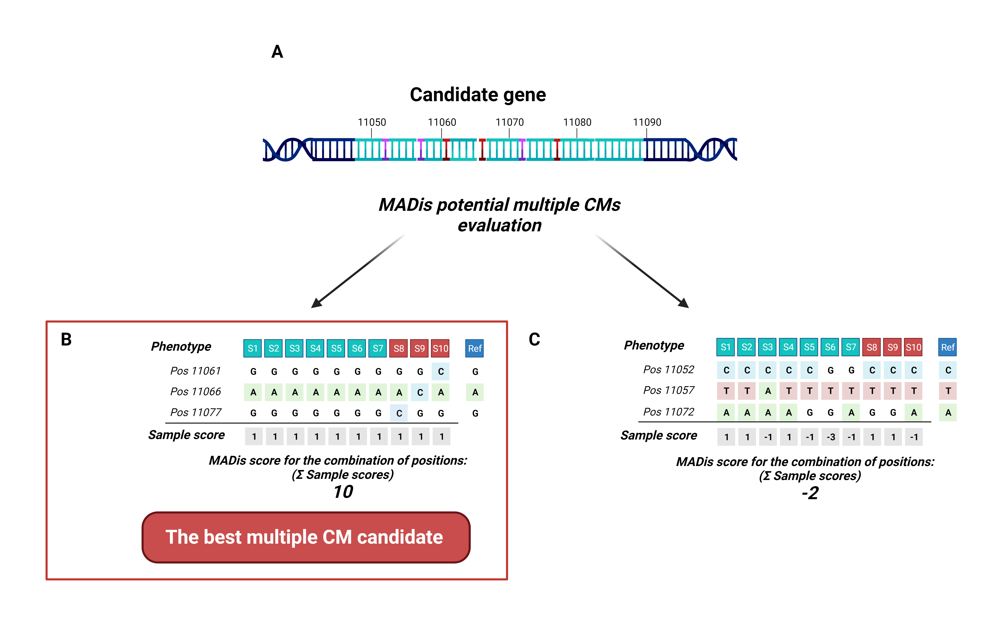

# MADis
MADIS is a Python-based tool designed to help with the identification of potential multiple allele CMs in the genes of interest. 
As multiple CMs are hard to discover with classical genomic tools like GWAS. The MADIS package uses user-provided phenotype and 
genotype data for the estimation of the potential multiple allele CMs. The correspondence between the set hypothesis and the 
tested combination of genotype positions and phenotype is expressed by scoring. The score determined the performance of the 
combination of genotype positions and phenotype as potential CMs for the identified trait. The MADIS results are the tab-based 
list of the best fitting genotype positions combination for the phenotype of interest with additional analysis information for 
easier evaluation of the provided results. The MADIS python package consists of 2 major functions for the user to utilize. The first
function import_vcf( ) enables to import of genotype data and transforms them into the genotype binary matrix used for MADIS
scoring. The second main function make_score( ) produces the result table with the potential multiple CMs scores 
and additional information.

The tool is developed in Python 3.8 programing language and utilizes the following Python packages: pandas(1.3.5, https://pandas.pydata.org/ accessible on 20.07.2023), 
NumPy(2.21.5, https://numpy.org/ accessed on 20.07.2023) and itertools(3.11.4, https://docs.python.org/3/library/itertools.html accessed on 20.07.2023).

## Phenotype and genotype selection
The definition of what is the MUT and the WT phenotype, the same as for selecting the reference genotype, is an important part of the analysis set that decides on the result meaning.
The WT phenotype represents the original phenotype from which the new MUT phenotype was developed in the evolution/breading process. The reference genotype represents the ancestral genotype from which the multiple CMs arose.

## The MADis calculation
The MADis score for candidate multiple CMs is a sum of individual sample scores determined by TABLE 1.

**TABLE 1 Individual sample score matrix for the combination of variant positions.** The individual score is calculated for every sample and is determined by the number of all Alt allele genotypes for WT and MUT phenotypes of a sample.
| Count of variant positions with Alt allele genotypes in the tested combination for an individual sample | Score of an individual sample with WT phenotype | Score of an individual sample with MUT phenotype |
| :---: | :---: | :---: |
| 0 | 1 | -1 | 
| 1 | -1 | 1 |
| 2 | -3 | -3 |
| 3 | -6 | -6 |
| 4 | -10 | -10 |
| 5 | -15 | -15 |
| 6 | -21 | -21 |
| 7 | -28 | -28 |

**The scheme of MADis sample score (ssc) assignment**. **A**, a simplified scheme of a gene with Alt alleles where red mutations are the CMs and the pink mutations are alleles without any effect on observed phenotype. **B, C,** Samples S1-S7 in blue have WT phenotype, and samples S8-S10 in red have MUT phenotype). The Ref column represents the ancestral reference genotype with WT phenotype. The rows are variant positions in a tested combination of an example data set. The grey row shows the sample score (ssc) values for individual samples. The MADis score is the sum of sample scores, where the MADis score for A is the maximal MADis score for this data set for the combination of three variant positions and thus, is considered as the best multiple CM candidate in comparison to the combination in **B**.

